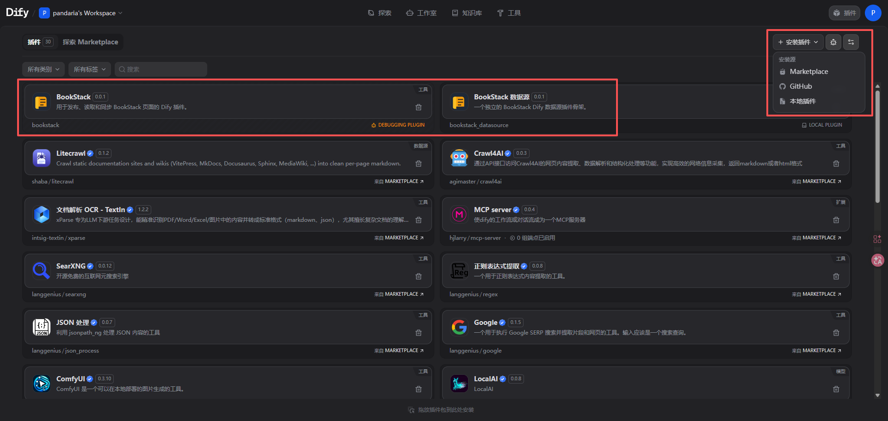
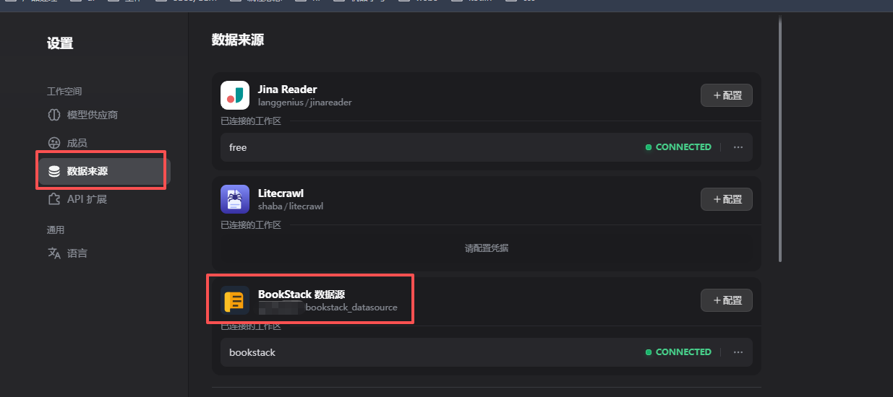
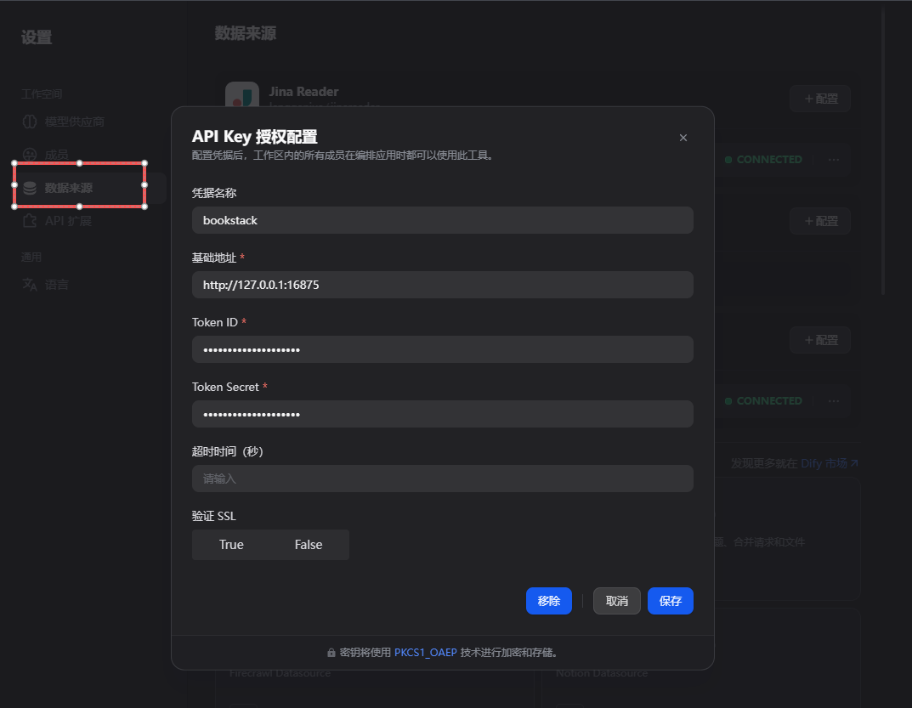
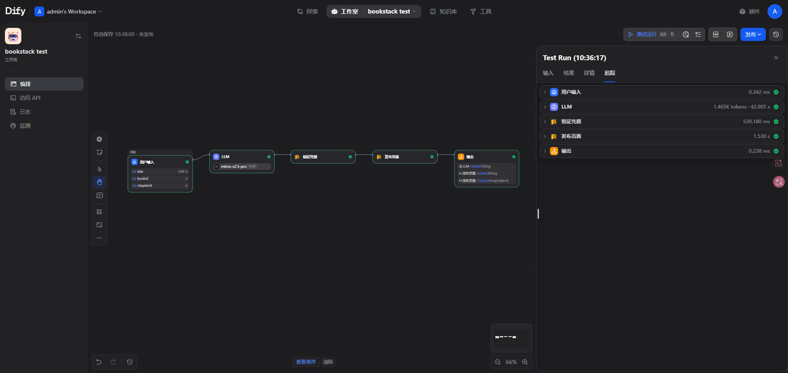
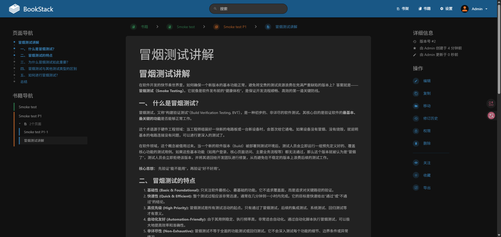

# BookStack Dify 插件使用说明

## 范围与当前定位

本仓库当前主要聚焦于面向 Dify 的 BookStack **Tool** 插件。

- 目前应将 Tool 插件作为主要使用路径。
- 另有一个独立的 Datasource 包存在，但它属于单独的包路线，不是主要用户路径。
- 不要将后续 Datasource 扩展理解为当前 Tool 插件工作流的一部分。

## 开始前准备

你需要：

- 一个支持插件导入的 Dify 环境
- 一个可访问的 BookStack 实例
- 在 BookStack 中创建好的 API 凭据

## 安装并导入插件

1. 从本仓库构建或获取 BookStack 插件包。
2. 打开 Dify 的插件管理区域。
3. 导入插件包。
4. 在插件列表中找到 BookStack 插件。
5. 打开 BookStack provider 设置。

### 导入流程截图

下面两张截图用于帮助你找到导入入口，并识别导入后的 BookStack 插件界面大致会是什么样子。



*可先根据这张图找到导入插件包前的 Dify 插件管理入口。*



*导入完成后，插件列表中的 BookStack 插件界面大致会与此类似。*

## 配置 Provider 凭据

仅通过 Dify provider 表单输入以下凭据：

- `base_url`：你的 BookStack 基础 URL
- `token_id`：BookStack API token ID
- `token_secret`：BookStack API token secret

保存凭据后的建议使用顺序：

1. 保存 provider 配置。
2. 先运行 `validate_credentials`。
3. 再尝试读取或写入工具。

### 凭据安全

- 不要在代码、文档示例或测试中硬编码凭据。
- 不要在日志、截图或工单中分享 `token_secret`。
- 不要分享原始 `Authorization` 请求头。
- 尽量优先使用演示或非生产环境的 BookStack 目标做早期验证。
- 如果截图中存在已填写的值，请在截图前替换为虚构占位内容。

### Provider 设置截图



*Provider 凭据配置表单，示例字段值已打码或替换为虚构内容。*

## 当前可用工具行为

### 已实现工具

- `validate_credentials`
- `search_pages`
- `get_page`
- `create_page`
- `update_page`
- `publish_page`
- `list_books`
- `list_chapters`
- `list_shelves`
- `list_pages`

### 重要使用说明

- `publish_page` 支持 create-or-update 行为。
- `list_books`、`list_chapters`、`list_shelves` 和 `list_pages` 是用于定位目标与内容的支持工具。
- 删除或归档操作不属于当前插件范围。
- 不要将未列出或仍在计划中的工具描述为已可用。

## 推荐的首次使用流程

1. 将插件导入 Dify。
2. 配置 `base_url`、`token_id` 和 `token_secret`。
3. 运行 `validate_credentials`。
4. 使用 `list_books` 和 `list_chapters` 找到可用的目标位置。
5. 需要检查现有内容时，使用 `search_pages` 或 `get_page`。
6. 选好目标后，再使用 `create_page`、`update_page` 或 `publish_page`。

按照这个顺序操作，可以保持当前 Tool-first 的主流程：先安装、再连接、先验证、后写入。

## 基础工作流示例：发布页面

当前最实用的端到端示例基于 `publish_page`。

适用场景：

- 在 Dify 中起草 Markdown
- 让人工复核内容和目标位置
- 然后创建或更新 BookStack 页面

### 建议节点顺序

1. 开始或触发节点
2. 草稿生成或上游内容节点
3. 结构化字段映射
4. 人工审核或审批步骤
5. `publish_page` 工具节点
6. 成功或失败分支路由

### 实用输入结构

```json
{
  "title": "Scheduler Design",
  "markdown": "# Scheduler Design\n\nApproved content...",
  "book_id": 1,
  "chapter_id": 12,
  "page_id": null,
  "tags": []
}
```

### 实用成功结果结构

```json
{
  "success": true,
  "action": "created_or_updated",
  "page_id": 123,
  "title": "Scheduler Design",
  "url": "https://<your-bookstack-host>/books/example/page/scheduler-design"
}
```

### `publish_page` 行为摘要

1. 如果提供了 `page_id`，工具会直接更新该页面。
2. 如果没有提供 `page_id`，工具会按精确标题搜索。
3. 如果提供了 `book_id` 和 `chapter_id`，会进一步缩小匹配范围。
4. 如果最终只剩一个精确匹配，就更新该页面。
5. 如果仍有多个精确匹配，重试前应先处理歧义。
6. 如果没有精确匹配，则创建新页面。

如果工作流已经知道稳定的目标页面，优先使用 `page_id`。

### 人工审核检查表

- 检查最终 `title`。
- 复核 Markdown 正文是否适合发布。
- 已知更新时核对 `page_id` 是否正确。
- 确认 `book_id` 和 `chapter_id` 指向预期位置。
- 判断当前是否应立即发布。

### 工作流截图



*可参考这张工作流画布，了解 `publish_page` 通常放在什么位置。*



*工具运行后，BookStack 中的页面结果通常会与此示例类似。*

## 故障排查

### 需要保留的面向用户错误文本

- `Invalid credentials`
- `Permission denied`
- `Book not found`
- `Chapter not found`
- `Page not found`
- `BookStack API unavailable`
- `Invalid BookStack response`

### 建议排查顺序

1. 在 Dify 中重新检查 `base_url`、`token_id` 和 `token_secret`。
2. 运行 `validate_credentials`。
3. 确认 BookStack 账户对目标内容具有访问权限。
4. 重新检查目标 `book_id`、`chapter_id` 或 `page_id`。
5. 如果 BookStack API 暂时不可用，请稍后重试。

### 写入工具注意事项

使用 `create_page`、`update_page` 或 `publish_page` 时，在重试前请先确认目标图书、章节或页面标识符。

## Datasource 状态

如果你正在评估 Datasource 支持，请先明确以下预期：

- 本仓库仍然是 Tool-first
- 已存在独立的 `bookstack_datasource/` 包
- Datasource 用法属于独立包路径，不是主 Tool 插件流程
- 更广泛的 Datasource 推广与发布就绪性仍是后续事项

当前已记录的 Datasource 路径，主要聚焦于按明确目标标识符同步 BookStack 内容，例如：

- 按 `page_id` 同步页面
- 按 `chapter_id` 同步章节
- 按 `book_id` 同步图书

## 隐私与打码说明

- 该插件仅连接到用户配置的 BookStack 实例。
- 该插件会根据你调用的工具读取、创建和更新 BookStack 页面、图书和章节。
- 该插件使用通过 Dify 插件凭据设置提供的 API 凭据。
- 除已配置的 BookStack 实例以及执行插件的 Dify 运行时之外，不应将内容发送给其他第三方。
- 该插件不会记录 `token_secret` 值。
- 页面内容后续如何被 Dify Workflow、Chatflow、Agent 或 Knowledge 功能使用，取决于你自己的 Dify 配置和数据处理选择。

后续如需补充截图，请仅使用示例数据，并打码：

- 真实 BookStack 主机名
- 真实 token 值
- 原始 `Authorization` 请求头
- 用户名
- 内部项目名称
- 生产页面 URL 或标识符
